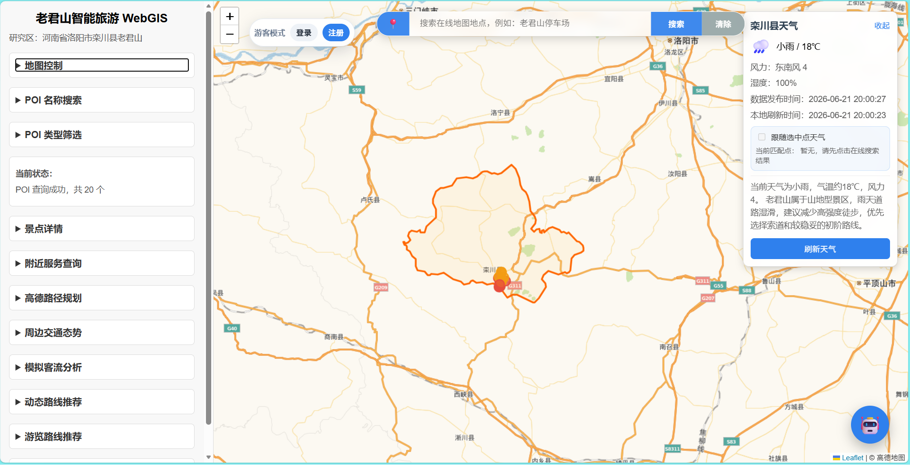

# 老君山智能旅游 WebGIS 系统

## 一、项目简介

本系统以河南省洛阳市栾川县老君山景区为案例区，构建集 WebGIS 地图展示、旅游 POI 查询、实时天气、路径规划、周边交通态势、模拟客流分析、基础路网展示、ECharts 数据大屏和大模型 Agent 旅游小助手于一体的智能旅游服务系统。

系统以 PostGIS 作为空间数据库，采用 Vue 3 + Leaflet 构建前端地图界面，采用 FastAPI 构建后端服务，接入高德 API 和智谱 AI GLM-4.5-Flash，实现基于大模型与功能 Agent 的旅游信息服务。

## 系统界面展示

下图为系统前端主界面，包含地图展示、图层控制、在线搜索、天气信息、路线规划、智能旅游助手和账号状态等功能模块。



## 二、技术栈

- 前端：Vue 3、Vite、Leaflet、ECharts
- 后端：FastAPI、Python
- 数据库：PostgreSQL、PostGIS
- 地图服务：高德地图瓦片、高德 Web 服务 API、高德 JS API
- 大模型：智谱 AI GLM-4.5-Flash
- 数据来源：景区 POI、栾川县边界、OSM 路网、旅游知识库、模拟客流数据

## 三、开发环境

- 操作系统：Windows 11
- Node.js：v24.15.0
- npm：11.12.1
- Python：3.12+
- PostgreSQL：14+
- PostGIS：3+
- Git：2.54.0

## 四、项目结构

```text
smart-tourism-webgis
├─ backend/        # 后端服务目录，基于 FastAPI 实现接口服务、数据库访问和 AI 调用
├─ data/           # 项目数据目录，存放处理后的业务数据或示例数据；原始大数据 data/raw/ 已通过 .gitignore 排除
│ ├─ processed/    # 已处理后的示例数据和空间数据
│ └─ database/     # 数据库相关辅助数据或初始化文件
├─ database/       # 数据库脚本目录，存放建表 SQL、初始化 SQL 等数据库相关文件
│ ├─ 10_create_auth_user_records.sql # 用户注册登录和用户记录表结构
│ └─ sql/          # PostGIS 扩展、业务表、知识库、路线、客流、索引等 SQL 脚本
├─ docs/           # 项目文档目录
│ ├─ api/          # 接口说明文档目录
│ ├─ screenshots/  # 系统截图目录
│ ├─ test/         # 系统测试记录目录
│ └─ thesis/       # 论文或设计说明相关资料目录
├─ frontend/       # 前端项目目录，基于 Vue 3 + Vite 实现地图页面、搜索、天气、路线规划和智能助手界面
├─ notebooks/      # 数据处理、实验分析或临时验证用的 Notebook 目录
├─ scripts/        # 项目辅助脚本目录，例如目录创建、数据处理或自动化执行脚本
├─ .gitignore      # Git 忽略规则文件，用于排除 .env、node_modules、虚拟环境、大型 GIS 数据、压缩包等不应上传的内容
├─ .gitkeep        # 空目录占位文件，用于保留 Git 默认不跟踪的空文件夹
└─ README.md       # 项目总说明文档，用于介绍项目功能、技术栈、目录结构和运行方式
```

说明：项目中的 `.env` 配置文件、`node_modules/`、Python 虚拟环境、`data/raw/` 原始 GIS 大数据、`.gpkg`、`.qgz`、压缩包和本地图片素材等文件已通过 `.gitignore` 排除，不会上传到 GitHub。

## 五、主要功能

1. 栾川县边界与老君山 POI 展示
2. 在线地图搜索与点位详情查询
3. 实时天气卡片与天气跟随点位
4. 高德路径规划与周边交通态势查询
5. 模拟客流点与客流热力图
6. OSM 基础路网展示
7. 多 Agent 智能旅游小助手
8. ECharts 智能旅游数据大屏
9. LangChain Demo 框架验证模块

## 六、启动方式

### 后端启动

```powershell
cd backend
.\.venv\Scripts\Activate.ps1
uvicorn main:app --reload --host 0.0.0.0 --port 8000
```

### 前端启动

> 前端项目基于 Vite 构建，运行前请先安装 Node.js 和 npm。

```powershell
cd frontend
npm install
npm run dev
```
